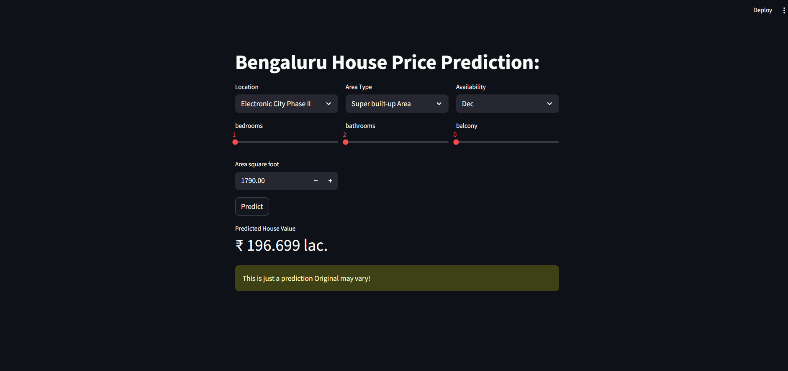

# Bengaluru (Bangalore) House Price Prediction


This is an end-to-end data science project that builds a complete pipeline to predict house prices in Bengaluru, India. The project includes data cleaning, extensive feature engineering, unsupervised learning (K-Means) for feature creation, and supervised model training (XGBoost).

The final model is deployed as an interactive web application using Streamlit.

## 🚀 Live Demo & Screenshots

*(**Note:** You should add a screenshot of your running `app.py` here.)*



The analysis included finding the optimal number of clusters for feature engineering using the Elbow Method:


## 📊 Project Overview

[cite_start]This project was completed as **Project 1: Local Real Estate Rental Analyzer** [cite: 2286] from the provided `Projects must do` document. [cite_start]The goal was to build a full-stack data science application following the **Scrape -> Clean -> Cluster (Unsupervised) -> Predict (Supervised) -> Deploy (Streamlit)** workflow[cite: 2286, 2306, 2315, 2323].

Due to data acquisition challenges (specifically, `robots.txt` blocking scrapers on major real estate sites), the project was pivoted from live scraping to using the public **"Bengaluru House Price Data"** dataset from Kaggle.

### Key Features
* **End-to-End Pipeline:** Covers every step from raw data ingestion to a deployed, interactive model.
* **Advanced Feature Engineering:** Uses K-Means clustering as an *unsupervised learning* step to create a new `cluster` feature, which acts as a "property archetype" to improve prediction accuracy.
* **Model Showdown:** Trains and evaluates multiple regression models, including Linear Regression, Lasso, Ridge, and XGBoost, to find the best performer.
* **Target Leakage Fix:** Successfully identified and resolved a critical **target leakage** bug where the scaler and clusterer were incorrectly trained on the target variable (`price`).
* **Interactive UI:** The final `app.py` provides a user-friendly Streamlit interface with sliders and select boxes for users to get live price estimates.

---

## 🛠️ Project Workflow

The entire process is documented in the `bengaluru_house_price_prediction.ipynb` notebook.

1.  **Data Acquisition:**
    * Initial attempts to scrape `Housing.com`, `99acres`, and `Magicbricks` were stopped due to `robots.txt` disallowing scraping of their search pages.
    * Pivoted to the "Bengaluru House Price Data" dataset from Kaggle.

2.  **Data Cleaning & Preprocessing:**
    * Handled over 5,500 missing values in `society` and imputed `bath`, `balcony`, and `location` using logical fills.
    * Created a custom function to convert the `total_sqft` column from text (e.g., "1000 - 1200", "34.46Sq. Meter") into a clean numerical feature.
    * Cleaned the `size` column from text (e.g., "2 BHK", "4 Bedroom") to a numerical value.
    * Engineered a `price_per_sqft` feature to identify and remove extreme outliers.

3.  **Feature Engineering (Unsupervised Learning):**
    * [cite_start]To fulfill the project's "Cluster -> Predict" goal[cite: 2286, 2306], K-Means clustering was applied to scaled numerical features (`size`, `bath`, `balcony`, `converted_sqft`).
    * The **Elbow Method** was used to determine the optimal number of clusters (*k*=3).
    * A new `cluster` feature was created and added to the dataset, significantly improving model performance.

4.  **Model Training & Selection (Supervised Learning):**
    * Handled high-cardinality categorical features (`location`) by grouping rare values into an "Others" category.
    * One-hot encoded `location`, `area_type`, and `availability`.
    * Split data into training and test sets.
    * Trained four models: Linear Regression, Lasso, Ridge, and **XGBoost**.
    * **XGBoost** was selected as the final model, achieving the highest R² score (~0.71) and lowest MAE (~33.2 Lakhs).

5.  **Deployment:**
    * The complete, *corrected* pipeline (XGBoost model, K-Means model, `MinMaxScaler`, and feature columns) was serialized into `xgb_model.json` and `model_data.joblib`.
    * An interactive web app was built using `streamlit run app.py`.

---

## ⚙️ Tech Stack & Libraries

* **Data Analysis & Manipulation:** Pandas, NumPy
* **Data Visualization:** Matplotlib, Seaborn
* **Machine Learning:** Scikit-learn (KMeans, LinearRegression, Lasso, Ridge, MinMaxScaler, train_test_split), XGBoost
* **Model Deployment:** Streamlit
* **Model Serialization:** Joblib

---

## 🚀 How to Run This Project Locally

1.  **Clone the Repository:**
    ```bash
    git clone [https://github.com/your-username/bengaluru-house-price-prediction.git](https://github.com/your-username/bengaluru-house-price-prediction.git)
    cd bengaluru-house-price-prediction
    ```

2.  **Create and Activate a Virtual Environment:**
    ```bash
    # Create a venv
    python -m venv venv
    
    # Activate on Windows
    .\venv\Scripts\activate
    
    # Activate on macOS/Linux
    source venv/bin/activate
    ```

3.  **Install Dependencies:**
    Create a `requirements.txt` file with the contents below and run:
    ```bash
    pip install -r requirements.txt
    ```

    **`requirements.txt`:**
    ```
    pandas
    numpy
    seaborn
    matplotlib
    scikit-learn
    xgboost
    streamlit
    joblib
    ```

4.  **Download the Data:**
    * Download the `bengaluru_house_prices.csv` dataset from Kaggle.
    * Rename it to `data.csv` and place it in the same folder as `app.py`.

5.  **Run the Streamlit App:**
    ```bash
    streamlit run app.py
    ```
    Your browser will automatically open to the interactive web app.

---

## ⚠️ Disclaimer

This is a project built for educational purposes. The predictions are based on a public dataset and should not be used as a real-world financial valuation or investment advice.